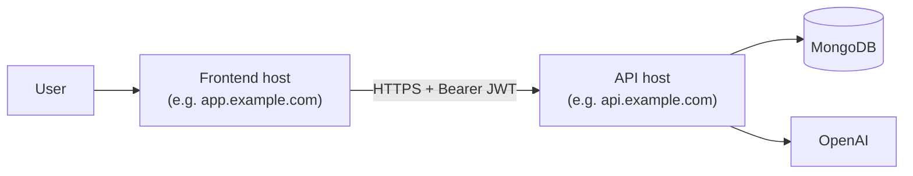
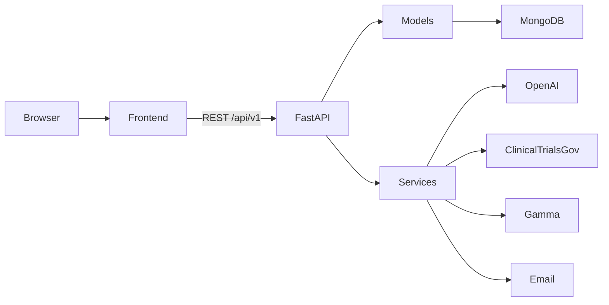

# Competitive Intelligence Platform

A multi-tenant SaaS platform for pharmaceutical competitive intelligence: news, publications, social media, competitive landscape (kanban), clinical trials, AI-assisted insights, reports, and tenant administration.

The repository is a **monorepo** with two applications:

| App | Path | Stack |
|-----|------|--------|
| **Backend API** | [`ci_backend/`](ci_backend/) | FastAPI, MongoDB (Motor), OpenAI |
| **Frontend** | [`ci_frontend/`](ci_frontend/) | TanStack Start (React 19), TanStack Router, Tailwind CSS, shadcn/ui |

---

## Table of contents

- [Prerequisites](#prerequisites)
- [Project structure](#project-structure)
- [Quick start](#quick-start)
- [Environment variables](#environment-variables)
- [Running locally](#running-locally)
- [API documentation](#api-documentation)
- [Architecture](#architecture)
- [Roles and access](#roles-and-access)
- [MongoDB collections](#mongodb-collections)
- [API overview](#api-overview)
- [Production deployment](#production-deployment)
- [Development notes](#development-notes)

---

## Prerequisites

| Requirement | Backend | Frontend |
|-------------|---------|----------|
| **Runtime** | Python 3.11+ (tested with 3.13) | Node.js 20+ |
| **Package manager** | `pip` + venv | `npm` (or `bun`) |
| **Database** | MongoDB (local or Atlas) | — |
| **External APIs** | OpenAI (required); Gamma (reports); email (optional) | — |

---

## Project structure

```
competitve_intelligence_platform/
├── README.md
├── .vscode/                    # Cursor/VS Code: auto-activate backend venv
├── ci_backend/
│   ├── main.py                 # FastAPI app, CORS, lifespan, routers
│   ├── config.py               # Settings from .env (pydantic-settings)
│   ├── requirements.txt
│   ├── .env.example
│   ├── models/                 # MongoDB access (tenant-scoped queries)
│   ├── routes/                 # HTTP routing only
│   ├── schemas/                # Pydantic v2 request/response models
│   ├── services/               # OpenAI, email, Gamma, clinicaltrials.gov, files
│   ├── utils/                  # JWT, passwords, pagination, logging helpers
│   ├── prompts/                # OpenAI prompt templates
│   ├── templates/              # Jinja2 email & PDF HTML
│   └── uploads/                # Profile photos & reports (served at /static)
└── ci_frontend/
    ├── vite.config.ts          # TanStack Start + Vite
    ├── package.json
    ├── wrangler.jsonc          # Cloudflare Workers deploy config
    ├── src/
    │   ├── routes/             # File-based TanStack Router pages
    │   ├── components/         # UI (shadcn/ui, layout, domain widgets)
    │   ├── api/                # HTTP client + backend integration
    │   ├── .env.development    # Local API URL (committed default)
    │   ├── .env.example
    │   ├── .env.production.example
    │   ├── store/              # Zustand (auth, filters, UI)
    │   └── hooks/
    └── public/
```

---

## Quick start

### 1. Clone the repository

```bash
git clone <your-repo-url>
cd competitve_intelligence_platform
```

### 2. Backend setup

```bash
cd ci_backend
python3 -m venv .venv
source .venv/bin/activate   # Windows: .venv\Scripts\activate
pip install -r requirements.txt
cp .env.example .env
```

Edit `ci_backend/.env` with at least the [required backend variables](#backend-required). Example for local development:

```env
MONGO_URI=mongodb://127.0.0.1:27017
DB_NAME=competitive_intelligence
JWT_SECRET=change-me-to-a-long-random-secret
OPENAI_API_KEY=sk-...
GAMMA_API_KEY=your-gamma-key
GAMMA_API_URL=https://your-gamma-pdf-endpoint
CORS_ORIGINS=http://localhost:8080
PUBLIC_BASE_URL=http://localhost:8000
```

Start MongoDB, then run the API (from `ci_backend/`):

```bash
uvicorn main:app --reload --host 0.0.0.0 --port 8000
```

- **Health:** [http://localhost:8000/health](http://localhost:8000/health)
- **Swagger:** [http://localhost:8000/docs](http://localhost:8000/docs)

### 3. Frontend setup

In a **second terminal**:

```bash
cd ci_frontend
npm install
cp .env.example .env.development   # optional; repo includes defaults for localhost
npm run dev
```

- **App:** [http://localhost:8080](http://localhost:8080)

The frontend calls the real API at `VITE_API_BASE_URL` (default `http://localhost:8000/api/v1`). Ensure `CORS_ORIGINS` on the backend includes `http://localhost:8080`.

**First login:** Create a superadmin for local dev:

```bash
cd ci_backend
python scripts/seed_admin.py --email admin@example.com --password 'YourSecurePass1'
```

Then sign in at [http://localhost:8080/login](http://localhost:8080/login). There is no public signup endpoint.

---

## Environment variables

### Backend (required)

| Variable | Description |
|----------|-------------|
| `MONGO_URI` | MongoDB connection string |
| `DB_NAME` | Database name |
| `JWT_SECRET` | Signing secret for JWTs (min. 16 characters) |
| `OPENAI_API_KEY` | OpenAI API key |
| `GAMMA_API_KEY` | Gamma API key (required at startup; used when generating reports) |

### Backend (optional)

| Variable | Default | Description |
|----------|---------|-------------|
| `GAMMA_API_URL` | — | Full URL for Gamma PDF generation |
| `CORS_ORIGINS` | `*` | Comma-separated allowed origins; use `http://localhost:8080` when running the frontend locally |
| `ACCESS_TOKEN_EXPIRE_MINUTES` | `30` | Access token lifetime |
| `REFRESH_TOKEN_EXPIRE_DAYS` | `7` | Refresh token lifetime |
| `PROFILE_UPLOAD_DIR` | `uploads/profile_photos` | Profile image storage |
| `PUBLIC_BASE_URL` | `http://localhost:8000` | Base URL for uploaded file links |

**Email** (optional — SendGrid or SMTP): see [`ci_backend/.env.example`](ci_backend/.env.example).

### Frontend

| Variable | Description |
|----------|-------------|
| `VITE_API_BASE_URL` | Full API prefix including `/api/v1`, no trailing slash |

**Local** — [`ci_frontend/.env.development`](ci_frontend/.env.development):

```env
VITE_API_BASE_URL=http://localhost:8000/api/v1
```

**Production** — set at **build time** (Vite inlines `VITE_*` into the bundle). Copy [`ci_frontend/.env.production.example`](ci_frontend/.env.production.example) and configure your CI/CD or hosting:

```env
VITE_API_BASE_URL=https://api.yourcompany.com/api/v1
```

---

## Running locally

Run **both** services during full-stack development:

| Service | Directory | Command | URL |
|---------|-----------|---------|-----|
| API | `ci_backend/` | `uvicorn main:app --reload --host 0.0.0.0 --port 8000` | :8000 |
| Web app | `ci_frontend/` | `npm run dev` | :8080 |

**Cursor / VS Code:** Opening a terminal in this workspace can auto-activate `ci_backend/.venv` (see `.vscode/settings.json`).

### Frontend scripts

```bash
cd ci_frontend
npm run dev      # development server
npm run build    # production build (Nitro + Cloudflare module preset)
npm run preview  # preview production build
npm run lint     # ESLint
```

### Backend (production-style)

```bash
cd ci_backend
uvicorn main:app --host 0.0.0.0 --port 8000 --workers 4
```

Static files (profile photos, generated PDFs) are served under **`/static`** from `ci_backend/uploads/`.

---

## Production deployment

Frontend and backend are **separate deployable units** on different hosts. Configure cross-origin access explicitly.



### Backend (API server)

1. Deploy `ci_backend/` to your API host (VM, container, PaaS).
2. Set environment from [`ci_backend/.env.example`](ci_backend/.env.example):
   - `CORS_ORIGINS=https://app.yourcompany.com` (your **frontend** origin only; comma-separate multiple)
   - `PUBLIC_BASE_URL=https://api.yourcompany.com`
   - Strong `JWT_SECRET`, production `MONGO_URI`, API keys
3. Run with a process manager, e.g. `uvicorn main:app --host 0.0.0.0 --port 8000 --workers 4`.
4. Terminate TLS at your load balancer or reverse proxy.

### Frontend (static / SSR host)

1. Set `VITE_API_BASE_URL` to your deployed API (e.g. `https://api.yourcompany.com/api/v1`).
2. Build: `cd ci_frontend && npm ci && npm run build`.
3. Deploy the build output per your stack (Cloudflare Workers via `wrangler.jsonc`, Node, S3+CDN, etc.).
4. The browser bundle talks to the API URL baked in at build time — rebuild the frontend when the API URL changes.

### Local vs production checklist

| Item | Local | Production |
|------|-------|------------|
| API URL | `http://localhost:8000` | `https://api.yourcompany.com` |
| App URL | `http://localhost:8080` | `https://app.yourcompany.com` |
| `VITE_API_BASE_URL` | `.env.development` | CI/CD / hosting env at **build** |
| `CORS_ORIGINS` | `http://localhost:8080` | Frontend origin(s) |
| Auth | JWT in `localStorage` (`ci.auth`) | Same; use HTTPS everywhere |

---

## API documentation

| Resource | URL |
|----------|-----|
| Swagger UI | [http://localhost:8000/docs](http://localhost:8000/docs) |
| ReDoc | [http://localhost:8000/redoc](http://localhost:8000/redoc) |
| OpenAPI JSON | [http://localhost:8000/openapi.json](http://localhost:8000/openapi.json) |

All routes are prefixed with **`/api/v1`**.

### Authentication

1. **`POST /api/v1/auth/login`** — body: `{ "email", "password" }`  
   Returns `access_token`, `refresh_token`, `redirect_hint`, `role`, `tenant_id`, `user_id`.

2. Protected routes:

   ```http
   Authorization: Bearer <access_token>
   ```

3. **`POST /api/v1/auth/refresh`** — body: `{ "refresh_token": "..." }`

**Redirect hints after login** (used by the frontend router):

- `superadmin` → `/superadmin/dashboard`
- `admin` / `user` → `/app/home`

### Response shape

Successful responses:

```json
{
  "success": true,
  "message": "OK",
  "code": "ok",
  "data": { }
}
```

List endpoints include pagination: `total`, `page`, `limit`, `pages`.

Errors:

```json
{
  "success": false,
  "message": "Description",
  "code": "error_code"
}
```

---

## Architecture



**Backend**

- **Multi-tenant:** Documents include `tenant_id`; isolation is enforced in **models**, not routes.
- **Layers:** routes (HTTP) → models (MongoDB) → services (external APIs).
- **Audit logs:** Mutating routes schedule `LogModel.record` as background tasks.
- **Async:** Motor + `async`/`await` throughout.

**Frontend**

- **TanStack Start** — SSR-capable React app with file-based routing under `src/routes/`.
- **State:** Zustand for auth and UI; TanStack Query for server state (when wired to the API).
- **UI:** Tailwind CSS v4, Radix primitives, shadcn-style components in `src/components/ui/`.

---

## Roles and access

| Role | Scope |
|------|--------|
| **superadmin** | Manage tenants and tenant admins; no tenant data APIs |
| **admin** | Full CRUD on tenant data + user management within the tenant |
| **user** | Read, download, email, compare, generate reports, notes, feedback |

---

## MongoDB collections

Created on startup with indexes:

`tenants`, `users`, `therapeutic_areas`, `indications`, `news`, `social_media_posts`, `publications`, `competitive_landscape`, `notes`, `feedbacks`, `chatbot_messages`, `logs`, `reports`, `clinical_trials`

`clinical_trials` syncs [ClinicalTrials.gov](https://clinicaltrials.gov/) data with a unique `(tenant_id, nct_id)` index.

---

## API overview

| Area | Endpoints |
|------|-----------|
| **Auth** | `POST /auth/login`, `POST /auth/refresh` |
| **Superadmin** | CRUD `/superadmin/tenants`, assign/remove admins |
| **Tenant** | `GET/PATCH /tenant/settings` |
| **Users** | CRUD `/users`, role, therapeutic areas |
| **Therapeutic areas** | CRUD + indication management |
| **News / Social / Publications** | List, CRUD, `POST .../highlights` |
| **Competitive landscape** | List, kanban, CRUD, `PATCH .../phase` |
| **Product profiles** | From competitive landscape + OpenAI |
| **Clinical trials** | List, get, `POST /clinical-trials/sync/{nct_id}` |
| **Competitors** | Distinct companies + optional financials |
| **Timeline** | Quarterly view from landscape data |
| **Reports** | `POST /reports/generate`, `GET /reports/{id}` |
| **Notes / Feedback** | User-scoped CRUD |
| **Chatbot** | `POST /chatbot/message`, `GET /chatbot/history` |
| **Logs** | `GET /logs` (admin only) |
| **Profile** | `GET/PATCH /profile`, password, photo upload |

---

## Development notes

### Backend

- Run `uvicorn` from **`ci_backend/`** so imports and `uploads/` paths resolve.
- **First user:** Seed a `superadmin` in MongoDB or use superadmin routes after seeding.
- **Reports:** Require `GAMMA_API_URL`; HTML from `templates/report_pdf.html` before Gamma.
- Dependencies: [`ci_backend/requirements.txt`](ci_backend/requirements.txt)

### Frontend

- **API client:** [`ci_frontend/src/api/client.ts`](ci_frontend/src/api/client.ts) — `apiFetch`, JWT attach, refresh on 401, paginated helpers.
- **Mappers:** [`ci_frontend/src/api/mappers.ts`](ci_frontend/src/api/mappers.ts) — backend snake_case → UI types.
- **Deploy:** Production builds use Nitro with the `cloudflare-module` preset; see `wrangler.jsonc` for Cloudflare Workers.
- Dependencies: [`ci_frontend/package.json`](ci_frontend/package.json)

### Tech stack summary

| Layer | Technologies |
|-------|----------------|
| API | FastAPI, Uvicorn, Motor, Pydantic v2, python-jose, OpenAI SDK |
| Web | React 19, TanStack Start/Router/Query, Vite 7, Tailwind 4, Zustand, Zod |

---

## License

Add your license here (e.g. MIT, proprietary).
